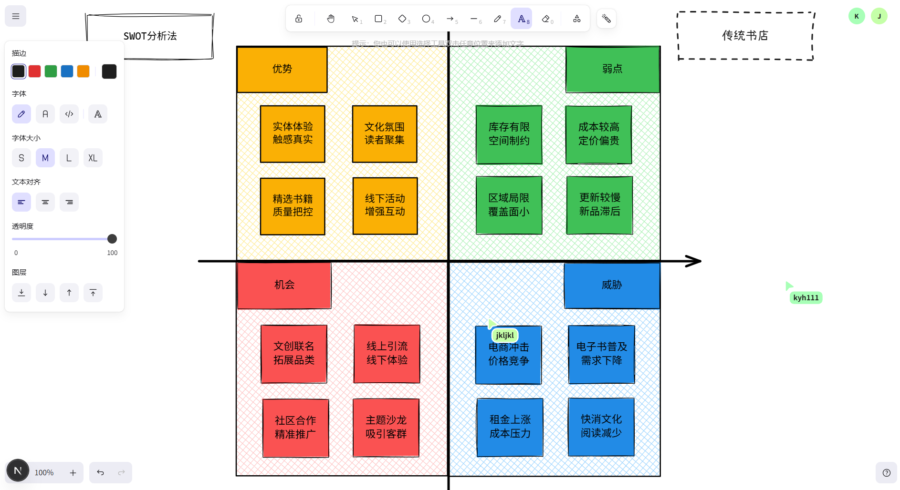
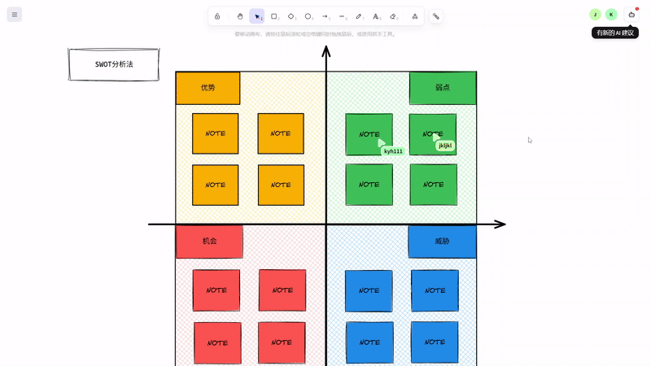
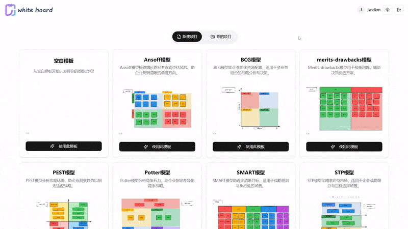
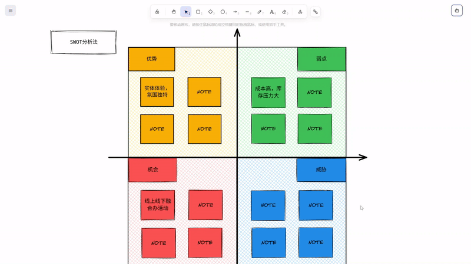

# White Board

A collaborative, real-time whiteboard application with business templates and AI-powered suggestions. Easily brainstorm, plan, and collaborate on visual ideas with your team.



## ✨ Features

- **Real-time collaboration** - Work together with team members simultaneously
- **Built-in business templates** - SWOT, PEST, BCG, Porter's Five Forces, and more
- **AI-powered suggestions** - Get intelligent recommendations while working
- **Project management** - Create, save, and organize multiple whiteboard projects
- **Responsive design** - Works on desktop and tablet devices
- **Dark/light mode** - Choose your preferred theme
- **Authentication system** - Secure login and registration

## 🛠️ Tech Stack

### Frontend
- Next.js 
- React
- TypeScript
- Excalidraw
- Framer Motion
- Radix UI
- Tailwind CSS

### Backend
- Spring Boot 3
- Java 17
- MySQL
- MongoDB
- Redis
- WebSockets

## 🚀 Getting Started

### Prerequisites

- Node.js (v18 or higher)
- Java 17 or higher
- MySQL
- MongoDB
- Redis

### Installation

#### Backend Setup

1. Clone the repository
   ```bash
   git clone https://github.com/yourusername/white-board.git
   cd white-board
   ```

2. Configure the database
   - Import the database schema
   ```bash
   mysql -u root -p < whiteBoard_db.sql
   ```

3. Update application properties if needed
   - Edit `/src/main/resources/application.properties` with your database credentials

4. Build and run the backend
   ```bash
   ./mvnw spring-boot:run
   ```

#### Frontend Setup

1. Navigate to the UI directory
   ```bash
   cd ui
   ```

2. Install dependencies
   ```bash
   npm install
   ```

3. Copy the environment file and configure it
   ```bash
   cp asserts/env-example.txt .env.local
   # Edit .env.local with your settings
   ```

4. Start the development server
   ```bash
   npm run dev
   ```

5. Open [http://localhost:3000](http://localhost:3000) in your browser

## 📸 Screenshots

| Home Page | Collaboration | Templates | AI Suggestions |
|-----------|--------------|-----------|----------------|
|  |  |  |  |

## 🧩 Available Templates

- SWOT Analysis
- PEST Analysis
- BCG Matrix
- Porter's Five Forces
- STP Marketing
- SMART Goals
- Ansoff Matrix
- Merits & Drawbacks Analysis
- Blank Template

## 🤝 Contributing

Contributions are welcome! Please feel free to submit a Pull Request.

